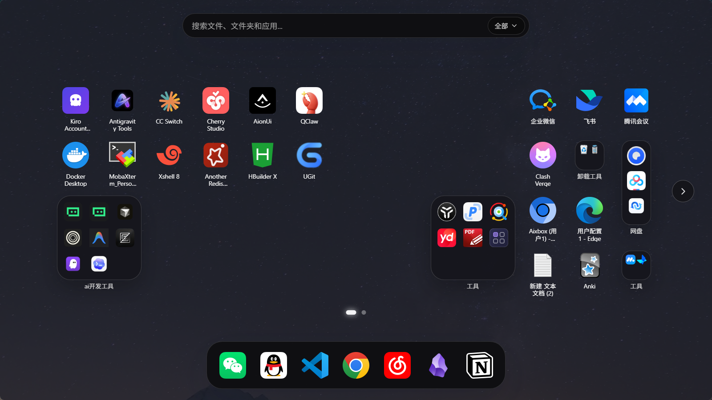
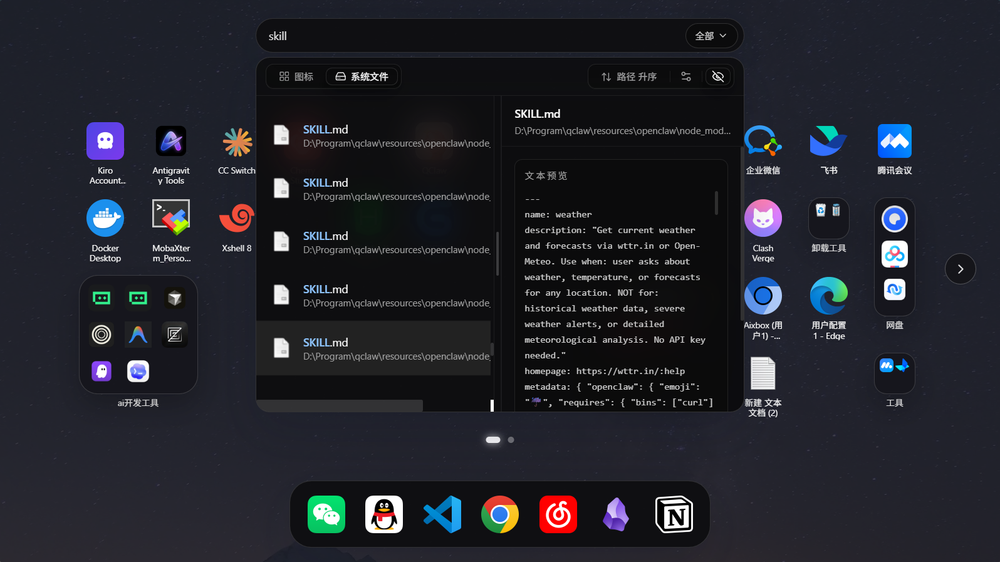
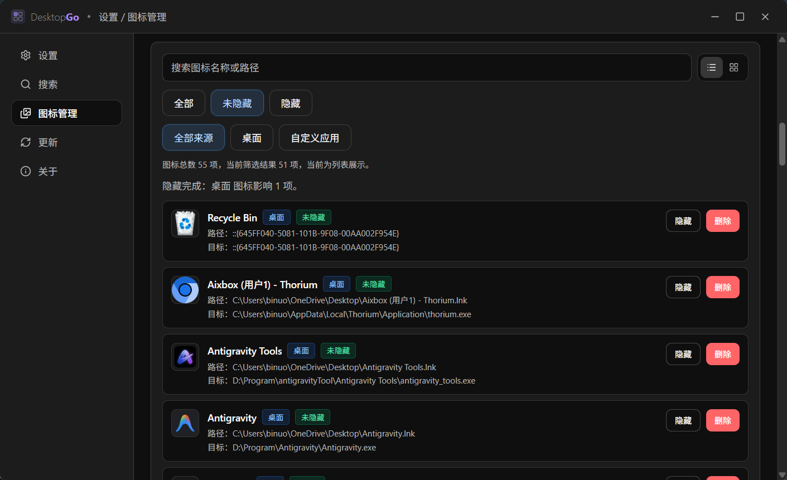

<p align="center">
  
</p>

<p align="center">
  <a href="./README.md">简体中文</a> | <strong>English</strong>
</p>

<h1 align="center">DesktopGo</h1>

<p align="center">
  A Windows desktop launchpad that brings app launching, icon organization, and Everything-powered file search into one focused entry point.
</p>

<p align="center">
  <a href="https://github.com/Aixbox/DesktopGo/releases/latest">Download Latest</a>
  ·
  <a href="https://github.com/Aixbox/DesktopGo/releases">Releases</a>
  ·
  <a href="https://github.com/Aixbox/DesktopGo/issues">Report an Issue</a>
</p>

<p align="center">
  
  
  
  
  
</p>

DesktopGo is a Windows desktop launchpad built with Tauri 2, React 19, and Rust. It borrows the interaction spirit of macOS Launchpad, but its feature set is designed around real Windows desktop workflows:

- A global shortcut to bring up a unified entry point
- Drag-and-drop, paged organization for desktop icons and custom app entries
- Fast file search, preview, and launch powered by Everything

## 🚀 Download

If you only want to use DesktopGo, you do not need Node.js or Rust locally. Just download the latest release:

- Latest release: <https://github.com/Aixbox/DesktopGo/releases/latest>
- All releases: <https://github.com/Aixbox/DesktopGo/releases>
- First public release notes: [`docs/RELEASE_NOTES/v0.1.0.md`](docs/RELEASE_NOTES/v0.1.0.md)

Install flow:

1. Download and run the latest installer.
2. If Everything is not installed on your machine yet, keep the "Install Everything" option enabled.
3. After installation, use the default shortcut `Ctrl+Space` to open the launchpad.

## 🖼 Screenshots

<table>
  <tr>
    <td colspan="2" align="center">
      
    </td>
  </tr>
  <tr>
    <td align="center">
      
    </td>
    <td align="center">
      
    </td>
  </tr>
</table>


## ✨ Highlights

### ⌨️ Launchpad Entry

- Global shortcut support, `Ctrl+Space` by default
- Tray-resident app with quick reopen behavior
- Main window hides automatically on blur
- Four window modes: `fullscreen`, `large`, `medium`, and `small`

### 🧩 Icon Organization

- Loads desktop icons into a launchpad-style grid
- Drag-and-drop sorting, paging, and cross-page movement
- Folder creation, rename, and open support
- Dock area for frequently used entries
- Bulk selection, hide, and delete operations
- Layout order and related settings are stored locally
- Supports a `customapp` directory for entries beyond the desktop

### 🔎 File Search

- Integrates Everything for fast file search
- Search history, filters, sort options, and keyboard navigation
- Preview support before opening results
- Virtualized loading for large result sets
- Search bar can switch between desktop icon search and Everything search

### ⚙️ Settings and Updates

- Theme, icon size, title lines, Dock visibility, and more
- Search behavior settings such as live search, default filters, sorting, and page size
- Icon management page for incremental or full sync of desktop and `customapp` sources
- GitHub Releases update channel already integrated

## 📊 Comparison

| Capability | DesktopGo | Native Windows Desktop | Everything Alone |
| --- | --- | --- | --- |
| Unified entry point | Launch, organize, and search in one place | Split across desktop, Start menu, and Explorer | Mainly focused on search |
| Global shortcut entry | Yes, default `Ctrl+Space` | Not a core workflow | Supports its own search window, not desktop organization |
| Desktop icon organization | Paged layout, drag-and-drop, folders, Dock | Basic layout only | No |
| File search | Yes, backed by installed Everything | Limited | Core strength |
| Result preview | Yes | Limited | Not the core focus |
| Local layout and settings persistence | Yes | Fragmented | Search-side config only |

## 🗺 Roadmap

### ✅ Done

- [x] Global shortcut, tray residency, and blur-to-hide launchpad behavior
- [x] Desktop icon loading, drag-and-drop sorting, paging, folders, and Dock
- [x] Everything search, history, filtering, sorting, and preview
- [x] Settings page, icon management page, and GitHub Releases update flow

### 🔜 Next

## ⚠️ Current Limits

- Windows only for now
- File search currently supports installed Everything only
- `customapp` scans one directory level only
- Updates depend on signed release artifacts and `latest.json`

## 🛠 Quick Start

### Development Requirements

- Node.js and `pnpm`
- Stable Rust toolchain
- Tauri prerequisites for Windows such as WebView2 and the MSVC build toolchain

### Run Locally

```bash
pnpm install
pnpm tauri dev
```

Notes:

- `pnpm tauri dev` starts both the frontend and the Tauri desktop shell, and is the primary development command for this project
- `pnpm dev` starts only the Vite frontend server, which is useful for UI-only work but not for validating full desktop behavior

## 📦 Common Commands

- `pnpm tauri dev`: start the desktop development environment
- `pnpm build`: build frontend assets into `dist/`
- `pnpm tauri build`: build the desktop installer/package
- `pnpm test`: run the current frontend script test in the repo
- `pnpm lint`: run ESLint
- `pnpm lint:fix`: auto-fix ESLint issues where possible
- `pnpm format`: format `src/**/*.{ts,tsx,css}`

## 🧱 Tech Stack

- Frontend: React 19, TypeScript, Vite 7
- Desktop shell: Tauri 2
- Native layer: Rust, Windows API, rusqlite
- State and interaction: Zustand, dnd-kit, Framer Motion, Radix UI
- Search: Everything SDK + IPC
- Persistence: Tauri Store + SQLite

## 📁 Project Structure

```text
DesktopGo/
├─ src/                     # React frontend
├─ src-tauri/               # Tauri / Rust / NSIS packaging config
│  ├─ src/                  # Tauri commands, Everything, icons, layout logic
│  ├─ nsis/                 # Windows installer hooks and language files
│  └─ resources/            # Everything SDK and installer resources
├─ docs/
│  ├─ RELEASE_NOTES/        # Release notes
│  └─ screenshots/          # README screenshot assets
├─ LICENSE.txt              # Project license
├─ README.en.md             # English documentation
└─ README.md                # Default Chinese documentation
```

## 🧩 Data and Directories

### `customapp` Directory

- When `customAppDir` is not explicitly configured, DesktopGo defaults to a `customapp/` directory next to the executable
- The directory is created automatically if it does not exist
- Only the first directory level is scanned right now

### Local Persistence

- General settings are stored through Tauri Store in `settings.json`
- Launchpad layout, search settings, and related state are stored in `app_state.db` under the local app data directory
- Icon organization and search runtime metadata are kept local-first, without a remote service dependency

## 🔧 Troubleshooting

### Search Is Not Working

Check these first:

- Whether Everything is installed
- Whether Everything is running
- Whether DesktopGo and Everything run at the same privilege level
- Whether the installer was allowed to install Everything

### `customapp` Entries Are Missing

- Confirm that `customAppDir` points to the expected directory in settings
- After adding new entries, run an incremental sync in settings
- If you reorganized the directory heavily, a full sync is safer

## 📄 License

Released under the MIT License. See [`LICENSE.txt`](LICENSE.txt).
